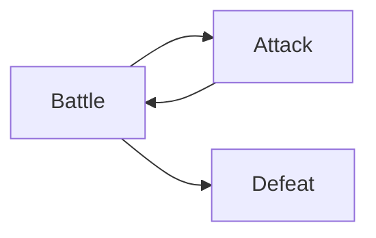
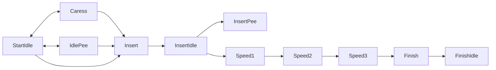
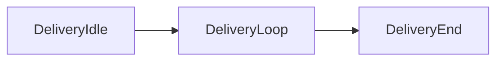

# HFramework

This doc explains HFramework for mod developers.

HFramework replaces the execution of scenes from the original game and create similar ones but wrapped in a
custom hooking engine that gives modders a considerable amount of control for customization.

It still has some limitation due to how the game works, but it should give more freedom for mod development.

You can see some use cases in [HExtensions](../HExtensions/README.md) and [Gallery plugins](../Gallery/README.md).


# Getting started

First, you must add HFramework as a dependency of your mod. To do that:

1. Download HFramework DLL and add it to your mod project (DON'T COMMIT IT)
2. Update your csproj to reference it as any other DLL:

```XML
	<ItemGroup>
		<Reference Include="HFramework">
			<HintPath>./Assemblies/HFramework.dll</HintPath>
		</Reference>
	</ItemGroup>
```

3. Declare it as dependency in your plugin startup:

```CS
	[BepInPlugin("MyPlugin", "MyPlugin", "0.1.0")]
	[BepInDependency("HFramework", "1.0.0")] // <---
	public class Plugin : BaseUnityPlugin
	{
		// ...
	}
```

You are now ready to use HFramework in many ways.


# Important objects and concepts

This section gives a brief information over some important classes and objects,
later on they will be explained in detail.

## Actor ordering

The pattern for HFramework is that we always use Male Actor, then Female Actor.
When both are of the same gender, the smallest NpcID comes first.

There is an exception, though: The definition of Rape scenes. In those cases,
The Rapist comes first, regardless of their gender. This is important because
you may have cases where Npc A (male) rapes Npc B (female), but the opposite
may also happen.

`IScene.GetActors()` always returns the default ordering.


## `IScene`

An `IScene` represents a Sex Scene. It is a common interface for every scene that
HFramework can run, both native and custom-made by other mods.

Lots of methods that you as a modder needs to implement will rely on this object.
You can interact with it to get information about the scene and to control it.


## `SexPerformer`

A `SexPerformer` is the object that holds the animation info and controls it.
Usually, `Perform` is called over it for animations to happen.


## Actor notation

Whenever we need to refer to an actor, specially in XML files, we use the following notation:

```
[NPCConst]#[NpcID]
```

Where `NPCConst` is the constant defined by YotanModCore and `NpcID` is their numerical ID.
`NpcID` is optional, but when informed must match the constant, or HFramework will warn.


# Hooking a scene

Hooking means you want a function to run when a specific _thing_ happen.
A _thing_ could be the start or end of step in the scene progression (
like the Battle on a rape scene or a caress start in a sex scene) or an event
(like a penetration) in the scene.

Hooks should always be configured during the `HookManager.RegisterHooksEvent` event.
This event is triggered by the Hooking engine when it is ready to register hooks,
and is the best moment to do so to prevent unexpected behavior.

To write your hooks, use `HookBuilder.New("UID")` and chain methods to configure it.
The UID uniquely identifies your hook and can be later used to declare order of execution
between hooks.

After that, you should use methods to configure your hooking target, which may be
limited to certain scenes, steps and/or events.

If you want to target a specific scene (like only scenes of player having sex with a NPC),
you can use the `ForScenes` method. It is recommended to use the scenes names from
their `Name` constant (example: `CommonSexNPC.Name`) to refer to the scenes.

If you want to target a specific step (like only when Caress happens), you can use
the `HookStepStart` and `HookStepEnd` methods. It is recommended to use the step names
from their `StepNames` constant (example: `CommonSexPlayer.StepNames.Caress`).

If you want to target a specific event (like only when a penetration happens), you can
use the `HookEvent` method. It is recommended to use the event names from their
`EventNames` constant (example: `EventNames.OnPenetrateVag`).

Once the target is configured, we can set how it will happen. You can use the `Call`
method to call a function when the target is triggered (when order doesn't matter).
If you need to call a function before or after another hook, you can use the `CallBefore`
or `CallAfter` methods.

Example:

```CS
HookManager.RegisterHooksEvent += () => {
	// When any scene starts, this.OnStart gets called
	HookBuilder.New("MyPlugin.Main")
		// "Main" is a special step name used in every scene to mean its "main loop"
		.HookStepStart("Main")
		.Call(this.OnStart);

	// When caress for CommonSexPlayer starts, this.OnCaress gets called
	HookBuilder.New("MyPlugin.PlayerCaress")
		.ForScenes(CommonSexPlayer.Name)
		.HookStepStart(CommonSexPlayer.StepNames.Caress)
		.Call(this.OnCaress);

	// When caress for CommonSexPlayer starts, this.OnCaress2 gets called BEFORE this.OnCaress
	HookBuilder.New("MyPlugin.PlayerCaress2")
		.ForScenes(CommonSexPlayer.Name)
		.HookStepStart(CommonSexPlayer.StepNames.Caress)
		.CallBefore("MyPlugin.PlayerCaress", this.OnCaress);
};

// ...

private void OnStart(IScene scene, object param)
{
	// ... Scene started ...
}
```

`param` here is a generic object that are sometimes set with a `FromTo` object.


# Remembering data on scenes

At certain times, you may need to store some temporary data related to a scene
when certain events happen in order to use it later on the scene.

For example, for HExtensions' DickPainter, there was a need to know whether the
girl was a Virgin before the initial penetration, but hooking the Penetration event
in a generic way would be too late. So we had to _Memorize_ the virgin status first.

To do that, you can use the `Memorize` method from `HookBuilder`.
It takes a function that must return a new `HookMemory` instance, which will be
attached to the running scene.

```CS
HookBuilder.New("HExt.DickPainter.Penetrate")
	.HookEvent(EventNames.OnPenetrateVag)
	.Memorize(() => new VirginMemory(MemoryId))
	.Call(this.OnPenetrate);
```

If you want to register a memorizing function but don't need to call a function,
you can use `.Set` instead of `.Call`.

Later on, to access the data, you can use the `GetHookMemory` method from `IScene`,
this will return the saved data. Once created, `HookMemory` objects stays in the scene
until it ends.

```CS
private IEnumerator OnPenetrate(IScene scene, object param)
{
	var memory = scene.GetHookMemory(MemoryId) as VirginMemory;
	if (memory == null || memory.IsVirgin == false)
		yield break;

	// ... Do whatever you need ...
}
```


# Debugging

The entire process emits many debug logs to help track what is happening,
while developing, it is recommended to change your BepInEx log level to `Debug`
in order to see them.


# HFramework under the hood

There are a few components in HFramework that works together to achieve its functionality,
it is important to understand their purposes and how they interact with each other.

First of all, you must know that every sex scene actually happens as a separate animated
prefab. The original actors are always hidden and a prefab is instantiated to make the
scene happen. This is a MUST for HFramework, as much as it is also true for the original game.

To exemplify it, let's consider a simple scene from the game:

> A female native NPC performs a sex scene with a male native NPC.
>

For that to happen, we have the following set of steps and events:

1. They move to a spot
2. They start the scene (💬: `(Start) Main`)
3. A penetration happens (🔥: `OnPenetrate:Vag`, 🔵: `Insert`)
4. First speed animation loops for 20 seconds (😀: `Speed1`)
5. Second speed animation loops for 10 seconds (😀: `Speed2`)
6. An orgasm happens (🔥: `OnOrgasm` , 🔥 : `OnCreampie:Vag`, 😀: `Finish`)
7. They enter a "idle" state (😀: `FinishIdle`)
8. They end the scene and each one goes back do their own stuff (💬: `(End) Main`)

This progression is called a **Scene** (represented by `IScene`) in HFramework.
In this case, it is a scene of `CommonSexNPC`.

And each of those emojis represents something important for this scene:

> [!NOTE]
> While this example has only 1 step, it is possible to have many.
> Check the scene code to see all the steps.

- 💬 - A step change
- 🔥 - An **event**
- 😀 - An **action** that changes the visual animation
- 🔵 - An **action** that does **not** change the visual animation

Events, actions and animations are controlled by a `SexPerformer`

A `SexPerformer` knows how to instantiate the animation, and controls the current state
of the animation. Also it knows which animation should be played for each action,
and give scenes/controllers the info they may need to progress.

Performers must have their state changed by `Perform`ing actions.

For example, in the above example, we have a performer controlling the animation of
the sex between Female Native and Male Native. This performer knows that:

1. The Prefab should be instantiated from the `SexList` entry;
2. It has one animation set, which:
   1. when performing a `Insert` action, should not show an animation, but emit a `OnPenetrate:Vag` event;
   2. when performing a `Speed1` action, should play the `A_Loop_01` animation;
   3. and so on

This abstraction allows the same performer to be used in different scenarios, as long as
they support similar actions.

Finally, a `ISceneController` (default: `DefaultSceneController`) is responsible for
handling actions that interferes with the progression, such as waiting for an input
or playing an animation for a while. Having the controller extracted like that
allows for some extra level of customization to be made directly in how certain
animations are played. Specially used by Gallery to allow the user to bypass timers,
for example.

With that structure, during the game start up, HFramework reads the default
definitions of scenes and performers from the definitions XML files and
associates to each scenes the appropriate performers.

The scene definition contains the conditions on which the performer could be played
and is then used by the game to determine whether a sex scene may start at any given moment,
replacing hardcoded checks from the original game.


# Adding custom performers

Performers must be added when the event `PerfomerLoader.OnLoadPerformers` runs,
this will ensure they are loaded once the HFramework is initialized.

You can either load performers from XML files or build then directly from code.
If you want to use the XML files, you may use the `PerformerLoader` utility methods.
For a code based approach, prefer `SexPerformerInfoBuilder` class.

One of the required configurations is a `PrefabSelector`, which is responsible for
instantiating the prefab that will be used to play the scene. In case the ones
provided by HFramework are not enough, you can add your own. Those should be registered
during the `PerfomerLoader.OnRegisterPrefabSelectors` event, like so:

```CS
PerfomerLoader.OnRegisterPrefabSelectors += () => {
	AddPrefabSelector(typeof(MyPrefabSelector));
};
```

`PrefabSelector`s must extend `BasePrefabSelector` and `IPrefabSelector`.

The below structure contains a commented XML explaining the different fields,
the same applies for the `SexPerformerInfoBuilder` class.

```XML
<!--
Starts a performer. The ID must be unique in the entire framework.
This ID is used whenever we need to refer to the performer.
-->
<Performer id="My_Performer">
	<!-- For which kinds of scenes this performer can be used. See scopes -->
	<Scopes>
		<Scope>Sex</Scope>
	</Scopes>
	<!-- How to instantiate the Prefab -->
	<PrefabSelector xsi:type="SexListPrefabSelector" listIndex="2" objIndex="0" />
	<!-- Which actors are involved in it -->
	<Actors>
		<Actor val="MaleNative#10" />
		<Actor val="FemaleNative#15" />
	</Actors>
	<!--  Animation Sets, are a collection of animations based on actions -->
	<AnimationSets>
		<!-- We must always have a Default set (but may also have others) -->
		<AnimationSet id="Default">
			<Animations>
				<!-- For action "Insert", run it "Once" but no animation is there. -->
				<Animation action="Insert" play="Once" name="">
					<!-- When this runs, those events must be emitted -->
					<Events>
						<string>OnPenetrate:Vag</string>
					</Events>
				</Animation>
				<!-- For action "Speed1", "Loop" the animation "A_Loop_01" -->
				<Animation action="Speed1" play="Loop" name="A_Loop_01" />
				<Animation action="Speed2" play="Loop" name="A_Loop_02" />
				<Animation action="Finish" play="Once" name="A_Finish">
					<Events>
						<string>OnOrgasm</string>
						<string>OnCreampie:Vag</string>
					</Events>
				</Animation>
				<Animation action="FinishIdle" play="Loop" name="A_Finish_idle" />
			</Animations>
		</AnimationSet>
	</AnimationSets>
</Performer>
```

A performer may cover one or more scopes. Following scopes are available:

- `Battle` - Rape battle (grapple/defeat)
- `Sex` - Sex scenes (normal/rape/etc)
- `Delivery` - NPC giving birth

The following diagrams shows more or less how actions are expected to happen.
This flow is not mandatory, but is usually followed by most scenes.

## Battle



## Sex

> ![NOTE]
> Several of those actions are very eventual, like Pee only really happening on Toilet,
> or Speed3 being very rare.



## Delivery




# Adding a scene

A scene class must be added when the event `ScenesManager.OnRegisterScenes` runs.

Those are the top level definitions so HFramework knows that a scene may receive
performers and be ready to receive them.

Performers must be linked to those scenes during `ScenesManager.OnRegisterScenePerformers`,
either from a XML file or from code. `ScenesLoader` may be used to read from XML files.

When adding a performer, you may provide a set of conditions that must be satisfied for
this performer to play. They come in 2 sets:

- `StartConditions`: Conditions requires for the actors to consider a possibility (They will try to start sex)
- `PerformConditions`: The decision to actually do it.

While they seem similar, `StartCondition` usually does not know _where_ something will happen,
so while you may have 2 performers that can be Started, maybe one requires a special bed
to _actually_ play. This is where `PerformCondition` makes a difference.

You can see the built in conditionals in `src/Scenes/Conditionals`, but you may also
create your own conditionals, as long as they extend `BaseConditional` and are
registered on `ScenesManager.OnRegisterConditionals` event
by calling `ScenesLoader.AddConditional`.


# Playing a scene

Playing a scene unfortunately still requires some boilerplate code, but it is feasible.

You can use the original ways of calling `SexManager`, or you can instantiate the scene yourself,
but each scene has some requirements to begin with.

Once the requirements are set, just instantiate the class and run `Run` method.


# Stopping a scene

Sometimes, you may want to completely stop the scene under some condition, for example through a hook.

IF you have access to the `IScene` object, just call `.Destroy` on it and it will try to terminate as
soon as possible.
