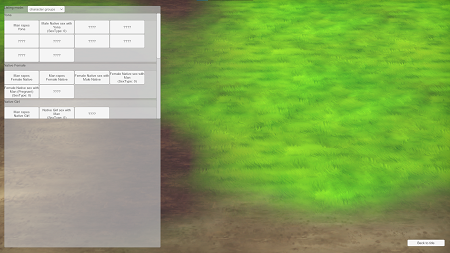
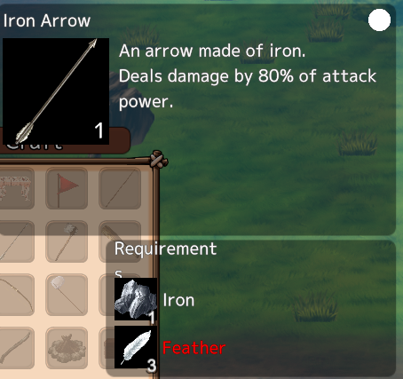
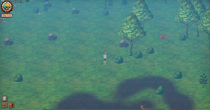
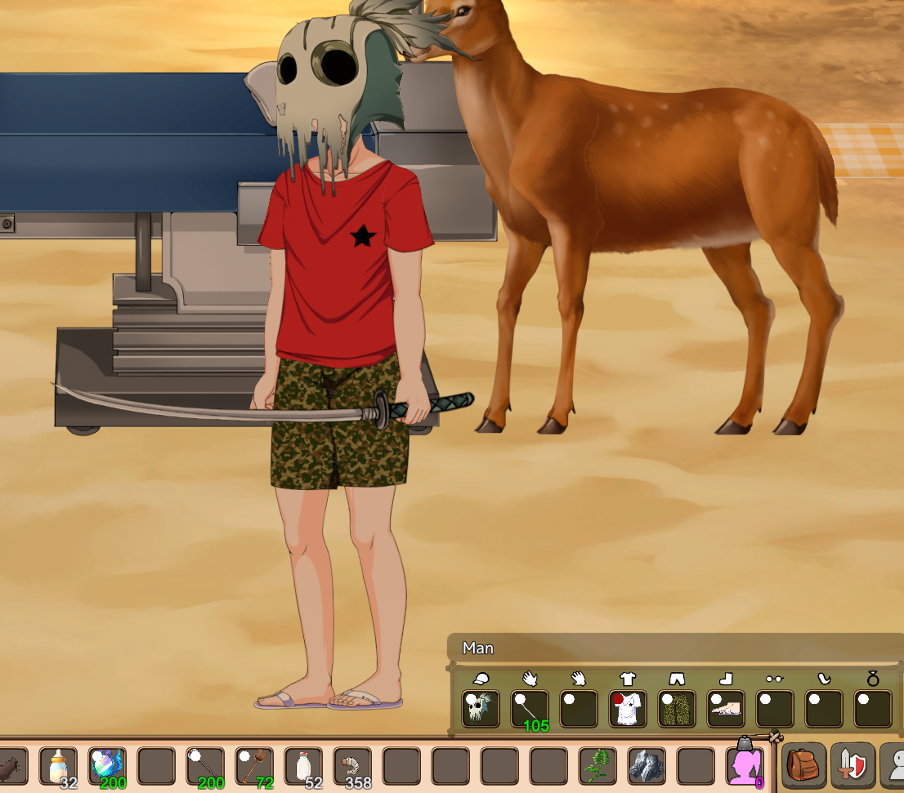

> [!CAUTION]
> This repository contains mods for the **ADULT GAME** Mad Island.
>
> Thus, **BEWARE** that when browsing this repository content you are likely to find text, code and _maybe_ images that are not suitable for a general audience.
>
> As much as possible, I tried to keep images either zipped or not in the repository at all, but be cautios.
> 

# Mad Island Mods

Mods for Mad Island game.


## Before you begin

> [!WARNING]
> Read this before you continue. Don't report a bug to the developers if you can't reproduce it without mods.
> 

Before you start, you need to know and understand that:

1. Every mod here can potentially break your game. They are changing the game code in ways the devs did not expect/know;
2. If you find a bug, check BepInEx console to check if a mod is not causing issues.
3. **Before** you report a bug to the game developer, try reproducing the bug without mods.

Let's not make the life of the developers harder. And responsibly enjoy a modded game :)


## Supported version

Since the game is in early access and getting active updates, the real support is focused in the latest version.

Unless otherwise noted in the mod section:

1. The current main version of the game should be supported;
2. The current beta (if any) version of the game should be supported;
3. versions >= old and < current are supported in a "best effort approach".
   1. If something breaks, I will try to add a workaround, but won't test it.
   2. New stuff also won't be tested.

When a new version is released, it is likely to break mods (see BepInEx console!!),
and I will fix it once I notice/have time. Feel free to contribute if you want.


## Installation

Before installing any mod, you must have BepInEx installed.

See installation instructions at: https://docs.bepinex.dev/articles/user_guide/installation/index.html

You need to install x64 version of BepInEx v5 (latest stable v5 available).

After you have it installed, download the mods that you need (and requirements, if applicable) from [Releases](https://github.com/yotan-dev/mad-island-mods/releases) and extract the files into `Mad Island Folder/BepInEx/plugins`.

> [!WARNING]
> Extract the zip files using "Extract here".
> The extracted files must stay AS IS in the `plugins` folder.
> If the zip contains a folder, this folder must be directly inside plugins.
> Don't rename the folder no put it in a subfolder, because the mod will expect the name to be exactly as shipped
> 

If the mod contains a single dll, the dll must be laying in the `plugins` folder (in other words, `Mad Island Folder/BepInEx/plugins/modname.dll` should exist).

If the mod contains a folder with 2 or more files, this folder must be in `plugins` one (in other words, `Mad Island Folder/BepInEx/plugins/modname/modname.dll` should exist).

If the mod mentions configuration, you should first start the game once so configuration files get generated, shut down the game and configure it at `BepInEx/config/` folder.


## Mod list

### Yotan Mod Core

This is main focused in being an utility library for mods. Additionally, adds some console commands.

Most mods require it, but it doesn't bring almost anything into the game by itself.

**Console commands:**

By pressing enter to open the console, you can run the default commands and also additional ones added by YotanModCore (or other mods that uses it).

YotanModCore commands:

**Note:** whenever `[friendId]` is mentioned, it is optional and when not informed it will follow this order:

1. Try to get selected NPC
2. If no NPC is selected, selects active player

- `/faint [friendId]`
  - faints a character
  - `[friendId]` is the target NPC friend ID
- `/heal`, `/healhp`, `/healst`, `/healfood`, `/healwater` - heals player HP/Stamina/Food/Water (`/heal` heals everything)
- `/makevirgin [friendId]`
  - resets basic sex info so character is considered virgin again
  - `[friendId]` is the target NPC friend ID
- `/moral [value] [friendId]` - changes character moral to `value`
- `/stun [value]` - overrides player stun damage to `value`. 0 disables it.


**For mod developers:**

You can check its API directly in the source code. I tried to keep it more or less documented. Feel free to depend on it.

It will follow semantic versioning and I will write about deprecations/removals when they come.

Please let me know if you are depending on it :)


### HFramework

Rewrites the game H-Scenes/system into a pluggable framework. This allows modders to interact with the H-System and expand it much easily.

> [!WARNING]
> When using the replacement mode (default), new scenes added to the game by the devs won't work until this mod is updated.

By default, it will replace the developer shipped H-Scenes with similar ones that are coded in the mod.
You can configure whether you want it to replace the original scenes or not, but most mods will need you to replace it.
You can change that on `BepInEx/config/HFramework.json`

HExtensions and Gallery plugins makes extensive use of it.

**For mod developers:**

- [Documentation](./HFramework/README.md)
- See HExtensions and Gallery plugins for examples


### HExtensions

> [!WARNING]
> This plugin is a work in progress. It only supports very few things right now.

Provides some modifications for H-Scenes. As explained below.

#### Require Foreplay

For H-Scenes with players, NPCs will refuse to continue if the player tries to "insert" before they are ready.

To enable it, go to `BepInEx/config/HFramework.json` and set `RequireForeplay` to `true`.

In the same file you can customize the required bar level and whether you want age and some random factors to apply over it.

#### Requirements

1. Yotan Mod Core must be installed.
2. HFramework must be installed.


### Gallery

By far the most ambitious of those mods. This implements a Gallery of game scenes.



1. After it gets installed, a new "Gallery" button is added to the main menu. The Gallery will only show scenes that you have unlocked.
2. To unlock a scene, you must execute it until "the end" (e.g. orgasm reached)

**Important:**

1. Currently, I am tracking many scenes that are not in Gallery yet
2. I am likely not tracking a scene or two, which once I found out may come out blocked. But most of them should be covered.

**Requirements:**

1. Yotan Mod Core must be installed.
2. HFramework must be installed.


**Technical notes:**

Progress is tracked in "GalleryState.xml" in Mad Islands root folder. This file is not saved to Steam Cloud.


### Enhanced Island

This mod provides several enhancements/minor changes to the game. It is highly configurable and each feature may be turned on/off at your will.

They are all enabled by default and using configurations that I like, so it is recommended to take a look before you play with it.

To configure, first install the mod and run Mad Island once. After that, you can change the settings on `BepInEx/config/EnhancedIsland.json`
or using [BepInEx Configuration Manager](https://github.com/BepInEx/BepInEx.ConfigurationManager) -- Restart the game after changing.


**Requirements:**

1. Requires YotanModCore installed.


#### Requirement checker (old: Craft Colors)
When trying to craft an item, the missing requirements will show in Red.




#### Disassemble Items

Crafted something by mistake? Don't need it any longer? Press `T` and get the materials back.


#### Better Workplaces (old: Enhanced Workplaces)

Does some improvements to NPC work.

Officially, NPCs works every few seconds, for 20 seconds, performing an action which generates 1 item. This is always like that.

This mod changes it a bit:

- There is a random factor over how much items an NPC will get.
- The random factor is improved by NPC level and morale.
- There is also a cap (so they don't get too much).

It currently affects Mining and Logging. When the drop of an item does happen, the amount will be:

- Lv1 items: (stone / wood)
  - Gives between 1 and 1 + Bonus items, capped at 10
  - Bonus starts at 0 and is increased by 1 every 10 levels or 25 moral
- Lv2 items: (iron / sap / wood 2)
  - Gives between 1 and 1 + bonus items, capped at 5
  - Bonus starts at 0 and is increased by 1 every 20 levels or 50 moral
- Lv3 items: (diamond)
  - Gives between 1 and 1 + bonus items, capped at 3
  - Bonus starts at 0 and is increased by 1 every 30 levels or 75 moral

**(MadIsland v0.1.8 and earlier)** Also, when doing Harvesting, if the NPC has a Fishing rod in their first inventory
slot, they will first try to collect any Fishtrap that has fishes in it.
This is officially supported since MadIsland v0.2.0 so the Mod won't do it for newer versions.


#### Increase Zoom

Allows you to zoom out much further.



**Note:** Zooming out is likely to use more PC resources, since the clipping panes/etc are also increased.


#### Item color in slot (old: ItemSlotColor)

Adds item color marker to item slots. Only for items that are dyeable.




#### NPC Stats

Properly give stats points to NPCs in different moments.

I made this mod because I noticed that high level captured NPCs or new borns were too weak,
making more sense to level one from the scratch.
This makes them get real points and randomly distributes them.

#### Configuration

After you start the game with Enhanced Island installed once, a config file will be created,
located at `BepInEx/config/EnhancedIsland.cfg`. You can edit it and change the way stats are distributed.

**Distribution mode:** How points are distributed.

- `EnemiesDistribution`: For enemies (natives in villages, etc)
- `TamedNpcDistribution`: For friendlied/tamed NPCs
- `NewbornNpcDistribution`: For new born NPCs

The values may be (note for exceptions):

- `Default`: Just like it is done in the original
- `Random`: Gives status points to NPC based on their level and randomly distribute over Health/Strength/Agility
- `ForceLevel1`: Resets the NPC to level 1 and clear their stats (Can't be used for Enemies)
- `Keep`: Keeps the stats as they were when the NPC was an enemy. If using ExtraStrong, it will be copied too. Can only be used for TamedNpc.


**Extra strong:** Should the default stats be applied over the distribution?

First, a background: every status increase in Mad Island causes
attack / speed / health to increase by a fixed amount, which is
dependent on the type of NPC. Let's call this `IncreaseBonus`.

When this setting is `true`, NPCs will be given a hidden increase
to their attack / speed / health of `<Level> * <IncreaseBonus>`.

This is equivalent to having DistributionMode = Default, but
this is a bonus that is added to the original distribution.

Enabling this option will make NPCs way stronger than normal,
so use with care.


#### Stack nearby

Press `V` to stack items from your inventory into all nearby chests.

**Note:** It lags a bit


#### Warp body

Press `P` while checking the inventory of a body to warp them to the nearest "respawn" point.

Useful when you get a pile of body near your base.


### YoUnnoficialPatches

Bug fixes implemented via modding. Let me know if there are other bugs that could be looked into.

Included:

- Translation (always on)
  - Translation of some boss names from Japanese to English
  - Translation of Quest UI titles to english
  - Translation of Surgery table / Cute Mirror to english
  - Translation of Craft "Ingredients", Shop "Buy", and "Paused" texts
  - Translation of Dye table UI from Japanese to English
- Prevent NPCs from starting H-Scenes if they don't have one
  - Enabled by default, can be disabled by changing `DontStartInvalidSex` in the config
- Fix some mosaics that are not being cleaned up
	- Enabled by default, can be disabled by changing `FixMosaic` in the config

I won't fix:

- Friend NPCs attacking new childs (without being able to hit) -- too hard to change with mods
- Automatically moving to the right -- I could not find the cause, looks like out of the game

**Requirements:**

1. Yotan Mod Core must be installed.


## Compatibility with Melon Loader

You can use Melon Loader mods together with BepInEx mods. But to do that, you **CAN'T** install Melon Loader directly. Instead you have to:

1. Install BepInEx: https://docs.bepinex.dev/articles/user_guide/installation/index.html
2. Install BepInEx Melon Loader plugin: https://github.com/BepInEx/BepInEx.MelonLoader.Loader
3. Put your MelonLoader mods inside MLLoader/Mods


## Support

If you find a bug, have questions or feature requests, feel free to open an issue. Feature requests may not be implemented by me.


## Contributing

Contributions are welcome. For small changes/bug fixes, just fork it and open a PR and I will review.

For bigger changes/new features, please open an issue for discussion first.


## Development Setup

1. Clone this repo
2. See `Assemblies/.gitkeep` for a list of DLLs you should copy from `<steam>/Mad Island_data/Managed/` into `Assemblies` folder and copy them


- You can build any mod by opening a shell in its folder and running `dotnet build`
- You can build all mods by opening a PowerShell and running:
```PowerShell
Set-ExecutionPolicy -ExecutionPolicy Unrestricted -Scope Process
.\make_release.ps1
```
DLLs will be put in Release folder


**NEVER** commit original game files.


## License

- Some code is copied/very similar to original decompiled source, those are kinda of propietary to Mad Island developers;
- Most of the code is made by me and is free to be reused as long as kept free and open source (be it as git repo or source distributed together with your mod).


## Project status

I think most of the mods have reached their "end state", while I do think I will come back from time to time, please note that I may not always be active.

Feel free to contribute, reviewing PRs are easier than making the changes, so it is much appreciated :)
