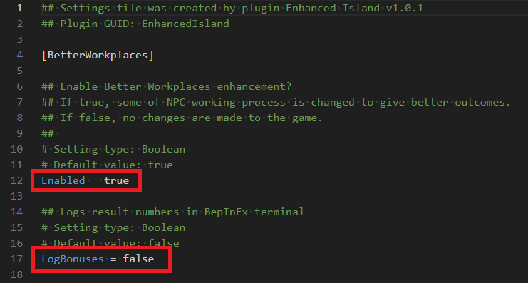

# Configuring mods

Many mods can be fine tuned to your desires, this page describes the overall process.

There are two ways to configure mods:

1. Using BepInEx Configuration Manager
2. Manually editing the config files

## Using BepInEx Configuration Manager

- [BepInEx Configuration Manager GitHub repo](https://github.com/BepInEx/BepInEx.ConfigurationManager?tab=readme-ov-file#how-to-use)

If you have it installed, you can press F1 (default, may be configured) in-game to open the configuration menu. It is recommended to restart the game after configuration changes.

## Manually editing the config files

After starting the game with a mod installed once, a config file will be created, located at `<Mad Island Folder>/BepInEx/config/<mod name>.cfg`.

You can open this file with any text editor (e.g. Notepad, VS Code, etc), change the configuration as you desire, and save it.

Lines starting with `#` are comments and will be ignored, you should focus on the normal
lines with a `=` sign. Only change the value after the `=`.

Usually the comments before it will explain what it does and how to set it.
