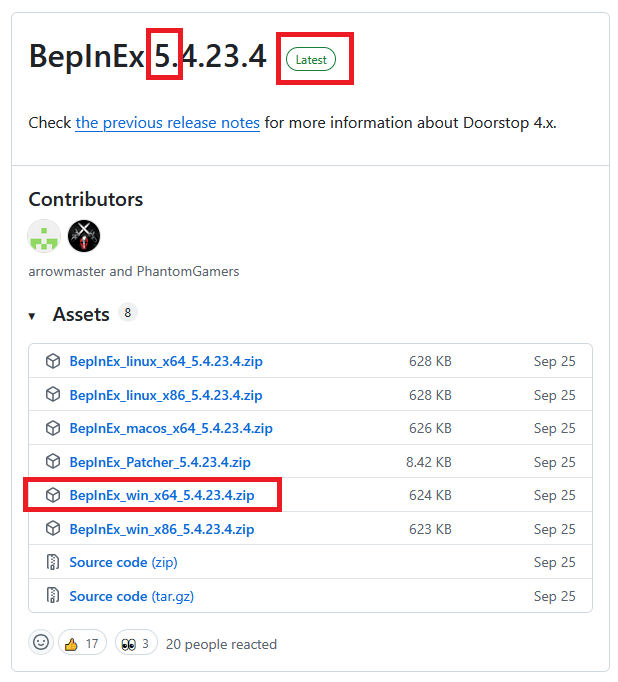

# Installing BepInEx

1. Download the latest version of BepInEx v5 for 64-bit Windows (`BepInEx_win_x64_5.x.x.x.zip` -- where `x` is any number) from the [BepInEx GitHub releases page](https://github.com/BepInEx/BepInEx/releases).

	

2. Go to Mad Island folder (right click the game on Steam > Manage > Browser local files)
3. Extract the downloaded file there (use `Extract here` option)
4. Start the game once so additional files are generated by BepInEx.
5. Close the game

You should now be ready to install mods. You probably want to go to [Yotan Mod Core](/end-user/yotan-mod-core.html) next.
