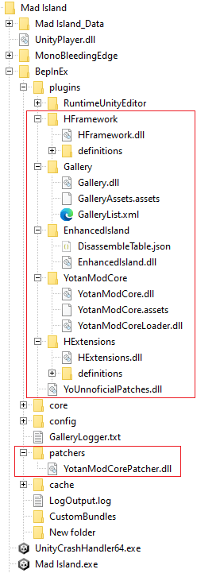

# End user docs

This part of the site contains information for end users, that is, people who want to use mods created by Yotan.

If you just want to uncensor your game, you should check the [decensoring](./decensoring.md) section.

> [!WARNING]
> Read this before you continue. Don't report a bug to the developers if you can't reproduce it without mods.
>

Before you start, you need to know and understand that:

1. Every mod here can potentially break your game. They are changing the game code in ways the devs did not expect/know;
2. If you find a bug, check BepInEx console to check if a mod is not causing issues.
3. **Before** you report a bug to the game developer, try reproducing the bug without mods.

Let's not make the life of the developers harder. And responsibly enjoy a modded game :)

## For mod developers

If you are a mod developer looking for information on how to create mods, please check the other sections:

- [Guide - Yotan Mod Core](/guide-ymc/introduction.html)
- [Code notes](/notes/damage-type.html)
- [API Reference](/api/HFramework.html)

## Supported versions

Since the game is in early access and getting active updates, the real support is focused in the latest BETA version.

Unless otherwise noted in the mod section:

1. The current BETA version of the game should be supported;
2. The current MAIN version of the game should be usually supported;
3. Versions before the current MAIN version are supported in a "best effort approach".
	1. If something breaks, I will try to add a workaround, but won't test it.
	2. New stuff also won't be tested.

When a new version is released, it is likely to break mods (see BepInEx console!!),
and I will fix it once I notice/have time. Feel free to contribute if you want.

## Before you start

Before you start, you need to have BepInEx installed and Yotan Mod Core installed.

- [Installing BepInEx](./install-bepinex.md)
- [Installing Yotan Mod Core](./mod-yotan-mod-core.md)

You may also want to install BepInEx Configuration Manager to make it easier to configure mods. See [Configuring mods](./configuring.md).

This is how a mod folder with a my mods installed should look like:

## Troubleshooting

If you encounter issues, try following the troubleshooting guide:
- [Troubleshooting](./troubleshooting.md)

## Available mods

- [Enhanced Island](./introduction.md)
- [YoCustomItems](./introduction.md)
- [YoUnofficialPatches](./introduction.md)

## HFramework-dependent mods

The mods in this section requires you to first install HFramework mod library/framework (similar to YotanModCore)

- [HFramework](./mod-hframework.md)

- [Gallery](./mod-gallery.md)
- [HExtensions](./mod-hextensions.md)

## Compatiblity with Melon Loader

You can use Melon Loader mods together with BepInEx mods. But to do that, you **CAN'T** install Melon Loader directly. Instead you have to:

1. Install BepInEx: https://docs.bepinex.dev/articles/user_guide/installation/index.html
2. Install BepInEx Melon Loader plugin: https://github.com/BepInEx/BepInEx.MelonLoader.Loader
3. Put your MelonLoader mods inside MLLoader/Mods

