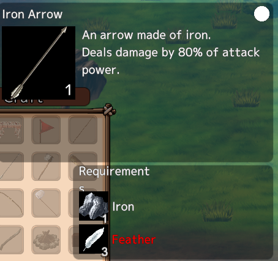

# Mod: Enhanced Island

This mod provides several enhancements/minor changes to the game. It is highly configurable and each feature may be turned on/off at your will.

They are all enabled by default and using configurations that I like, so it is recommended to take a look before you play with it.

## Requirements

1. Requires [YotanModCore](./mod-yotan-mod-core.md) installed.

## Installation

1. Download the latest version from [Releases](https://github.com/yotan-dev/mad-island-mods/releases)
2. Move the ZIP file to your BepInEx plugins folder (`right click the game on Steam > Manage > Browser local files`, then go to `BepInEx/plugins`)
3. Extract the ZIP file there (use "Extract here" option)
4. Start the game once so config files are generated by it.
5. Close the game

## Configuration

See [Configuring mods](./configuring.md) for more info.

Every mod has a `Enabled` config that allows you to enable (`true`) or disable (`false`) it.

## What it does

### Requirement checker
When trying to craft an item, the missing requirements will show in Red.

### Disassemble Items

Crafted something by mistake? Don't need it any longer? Press `T` and get the materials back.

### Better Workplaces

Does some improvements to NPC work.

Officially, NPCs works every few seconds, for 20 seconds, performing an action which generates 1 item. This is always like that.

This mod changes it a bit:

- There is a random factor over how much items an NPC will get.
- The random factor is improved by NPC level and morale.
- There is also a cap (so they don't get too much).

It currently affects Mining and Logging. When the drop of an item does happen, the amount will be:

- Lv1 items: (stone / wood)
	- Gives between 1 and 1 + Bonus items, capped at 10
	- Bonus starts at 0 and is increased by 1 every 10 levels or 25 moral
- Lv2 items: (iron / sap / wood 2)
	- Gives between 1 and 1 + bonus items, capped at 5
	- Bonus starts at 0 and is increased by 1 every 20 levels or 50 moral
- Lv3 items: (diamond)
	- Gives between 1 and 1 + bonus items, capped at 3
	- Bonus starts at 0 and is increased by 1 every 30 levels or 75 moral

**(MadIsland v0.1.8 and earlier)** Also, when doing Harvesting, if the NPC has a Fishing rod in their first inventory
slot, they will first try to collect any Fishtrap that has fishes in it.
This is officially supported since MadIsland v0.2.0 so the Mod won't do it for newer versions.

### Increase Zoom

Allows you to zoom out much further.

**Note:** Zooming out is likely to use more PC resources, since the clipping panes/etc are also increased.

### Item color in slot

Adds item color marker to item slots. Only for items that are dyeable.

### NPC Stats

Properly give stats points to NPCs in different moments.

I made this mod because I noticed that high level captured NPCs or new borns were too weak,
making more sense to level one from the scratch.
This makes them get real points and randomly distributes them.

### Configuration

After you start the game with Enhanced Island installed once, a config file will be created,
located at `BepInEx/config/EnhancedIsland.cfg`. You can edit it and change the way stats are distributed.

**Distribution mode:** How points are distributed.

- `EnemiesDistribution`: For enemies (natives in villages, etc)
- `TamedNpcDistribution`: For friendlied/tamed NPCs
- `NewbornNpcDistribution`: For new born NPCs

The values may be (note for exceptions):

- `Default`: Just like it is done in the original
- `Random`: Gives status points to NPC based on their level and randomly distribute over Health/Strength/Agility
- `ForceLevel1`: Resets the NPC to level 1 and clear their stats (Can't be used for Enemies)
- `Keep`: Keeps the stats as they were when the NPC was an enemy. If using ExtraStrong, it will be copied too. Can only be used for TamedNpc.

**Extra strong:** Should the default stats be applied over the distribution?

First, a background: every status increase in Mad Island causes
attack / speed / health to increase by a fixed amount, which is
dependent on the type of NPC. Let's call this `IncreaseBonus`.

When this setting is `true`, NPCs will be given a hidden increase
to their attack / speed / health of `<Level> * <IncreaseBonus>`.

This is equivalent to having DistributionMode = Default, but
this is a bonus that is added to the original distribution.

Enabling this option will make NPCs way stronger than normal,
so use with care.

### Stack nearby

Press `V` to stack items from your inventory into all nearby chests.

**Note:** It lags a bit

### Warp body

Press `P` while checking the inventory of a body to warp them to the nearest "respawn" point.

Useful when you get a pile of body near your base.

