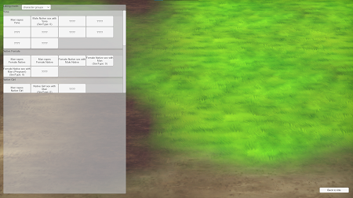

# Mod: Gallery

By far the most ambitious of those mods. This implements a Gallery of game scenes.

1. After it gets installed, a new "Gallery" button is added to the main menu. The Gallery will only show scenes that you have unlocked.
2. To unlock a scene, you must execute it until "the end" (e.g. orgasm reached)

**Important:**

1. Currently, I am tracking many scenes that are not in Gallery yet
2. I am likely not tracking a scene or two, which once I found out may come out blocked. But most of them should be covered.

## Requirements

1. Yotan Mod Core must be installed.
2. HFramework must be installed.

## Installation

1. Download the latest version from [Releases](https://github.com/yotan-dev/mad-island-mods/releases)
2. Move the ZIP file to your BepInEx plugins folder (`right click the game on Steam > Manage > Browser local files`, then go to `BepInEx/plugins`)
3. Extract the ZIP file there (use "Extract here" option)
4. Start the game once so config files are generated by it.
5. Close the game

## Technical notes

Progress is tracked in "GalleryState.xml" in Mad Islands root folder. This file is not saved to Steam Cloud.
