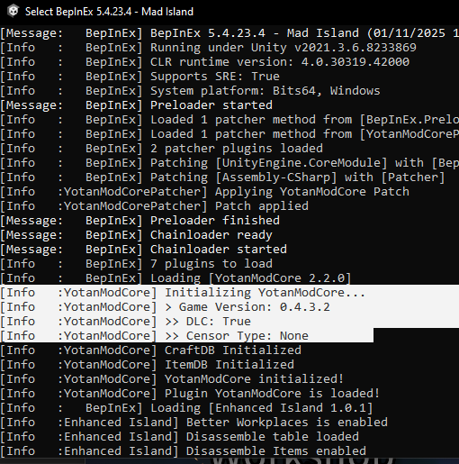

# Troubleshooting

This page lists general troubleshooting tips and solutions, and also how to better seek help.

## Before you start - Enable BepInEx Console

It is highly recommended to enable BepInEx console and check it for errors. Most of the time,
this will contain helpful information, either for you or for whoever is trying to help.

1. Open the BepInEx config (`BepInEx/config/BepInEx.cfg`)
2. Set `EnableConsole` to `true`
3. Restart the game

This will make a console/CMD window open together with the game, check it for errors.
They usually contain the mod name together with the message, which can help identify the culprit and maybe the issue.

Try reading those.

## General tips

1. Make sure your game is up to date
2. Make sure your mods are up to date
3. Know which version of the game you are using
	- Modders may not be testing their mods on the main version, only on BETA
	- Mods may not work on BETA versions as soon as they are released
	- If you are on BETA and a new version was just released, give a few days for modders to update their stuff
4. If you are on MAIN and the mod is erroring, try using BETA version of the game (or ask the modders directly)

For Yotan mods: I try to maintain mods working on both Main and Beta versions, but I usually don't test on Main, and sometimes it is just not possible. BETA will always be my focus.

## Reporting issues / Asking for help

When reporting an issue or asking for help, make sure to include the following information:

1. Game version -- if possible, copy the version from the console

2. Tell us whether you have DLC or not
3. Tell us which mods you have installed and their versions
4. Tell us errors you are seeing on Console
5. Provide your `BepInEx/LogOutput.log` file
6. Try to reduce the number of mods to help us debugging
