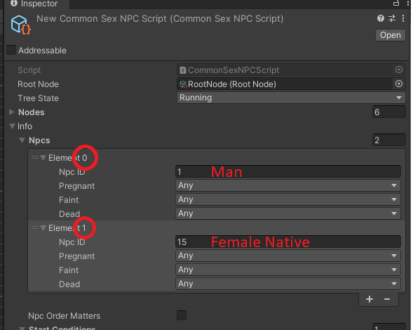
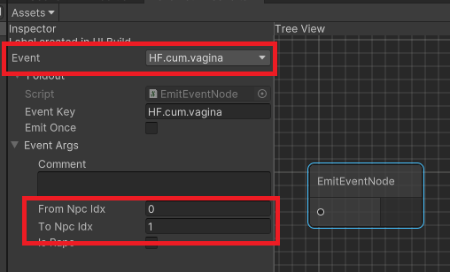

# Nodes

## Node execution flow

In the above example we were focusing on `OnUpdate()` method of the nodes, but each node has a lifecycle with 3 different methods:

- `OnStart()` - called when the node is first executed (the first time it is "updated")
	- This is ideal to initialize node's internal state (for example, a counter)
	- If a node has completed its work, if it gets started again (e.g. due to `Repeat`, it will run `OnStart` again)
- `OnUpdate()` - called every frame while the node is running
	- This is ideal to do repetitive actions, and to decide whether it is complete.
	- It is recommended that if the node does a single thing and completes, this should be done here.
- `OnStop()` - called when the node is terminated
	- This is ideal to clean up resources

## The Node states

Every node is in one of the following states:

- `Running` - the node is currently executing
- `Success` - the node has completed successfully
- `Failure` - the node has failed

When a node starts its execution, it is in the `Running` state. Every time `OnUpdate` is triggered, it should tell what will be the next state of the node. We usually expect that every node will either `Success` when it finishes its work, or `Failure` if it fails.

## An example of a Node flow

We have the `MoveToPlaceNode`, a Node that makes all the involved actors move to a designated spot within a time limit, while showing an emotion over their heads.

Let's break that into the execution flow.

### OnStart

This runs first, as soon as we start the process, here we:

1. Set an internal timer to the remaining time (`this.remainTime = this.timeLimit`)
2. Show emotions over their heads, storing the emotion references in the node
3. Trigger the movement of actors to the sex place (this is a one time function call)

### OnUpdate

This will now run on every tick, here we:

1. Decrease the internal timer by the delta time
2. Check if the movement is complete -- if so, return `Success`
3. Check if we have run out of time -- if so, return `Failure`
4. Otherwise, we are still waiting for it, so return `Running`

### OnStop

Once we reached `Success` or `Failure`, it is clean up time:

1. Remove the emotions from the actors

## NPC Indexes

Certain nodes may need to refer to NPCs, for example, if we want to emit a "Creampie" event, we want to tell who creampied who. In those cases, we will use NPC indexes.

Let's look at this example of a Sex Script:

We can see that `Man` (NpcID = 1) is at index 0, and `Female Native` (NpcID = 15) is at index 1. Remember this.

Now, let's look at the EmitEvent node in the Behavior Tree:

You can see that we have the `Event` set to `HF.cum.vagina` (HFramework provided event for "creampies"). And on the `EventArgs` section, we have `From Npc IDX = 0` (Remember, 0 = Man), and `To Npc IDX = 1` (Remember, 1 = Female Native).

Internally, HFramework will convert these references to the actual NPCs while emiting the events.

We will talk more about events in the [Events](./events.md) section.

## Types of nodes

@TODO

