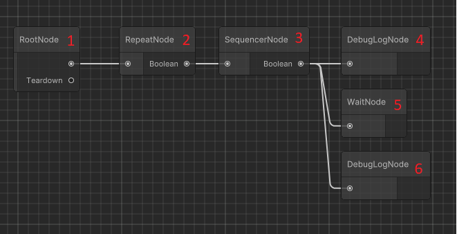
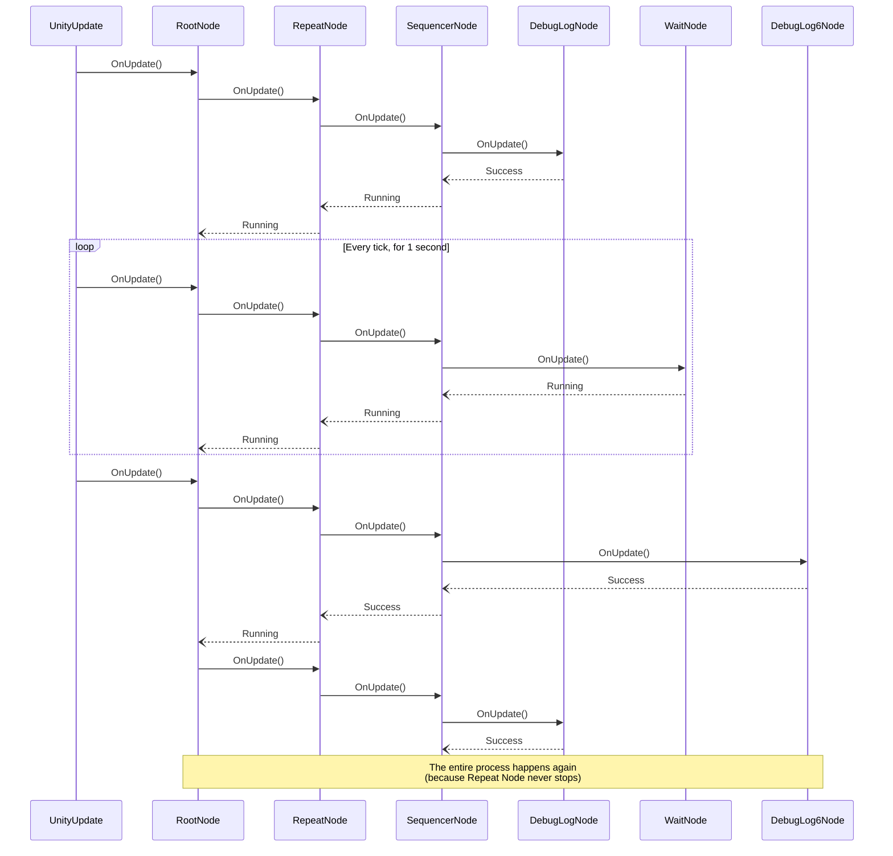

# Sex scripts (Behavior tree)

Sex Scripts are what makes HFramework tick. It contains the basic information related to one sex interaction, its triggering information, the contextual data and also a graph containing nodes that will be triggered in order to perform bits of the sex interaction.

There is a lot to understand here, so let's break it into parts.

## Basic information

First, once a sex script is created, you can see on the UnityEditor that the inspector will show a few fields, the only one we should be touching is `Info`.

`Info` explains which NPCs are involved in this script and the conditions for this script to be chosen.

### NPCs (list)

Each NPC involved in the sex script **start** should be included here, including what you expect their "state" to be.

- **Npc ID** -- The NPC common ID (E.g. 0 = Yona, 15 = Female Native, etc)
- **Pregnant** -- What kinds of Pregnant State are accepted (See `PregnantState` enum)
- **Faint** -- What kinds of Faint State are accepted (See `FaintState` enum)
- **Dead** -- What kinds of Dead State are accepted (See `DeadState` enum)

The order here will be important in 2 moments:

- If using `Npc Order Matters`
- When referencing NPCs in the graph

### NPC Order Matters (bool)

When the game tries to start a sex interaction, it usually gives us the actors in some kind of order. In some cases, this does not matter (e.g. 2 NPCs having normal sex -- they will get the same scene anyway). In other cases, it does (e.g. NPC A raping NPC B -- you will get a totally different scene depending on the order).

If this is checked, HFramework will only accept this script if the NPCs in `NPCs` setting are in the exact same order as the game provided them.

If this is not checked, HFramework will accept this script if the NPCs in `NPCs` setting are in any order, as long as all the conditions are met.

Internally, we try to match the NPCs from the most specific condition to the most broad one.

### Start conditions

This is a list of grouped conditions that must be satisfied for this Sex Script to be "Started". That means, for the game to even consider trying to sex those NPCs. (Remember the `CanStart` from [How MI Works](../how-mi-works.md)?)

Each group will be evaluated as an "OR", meaning if one of the groups are satisfied, we can start it.

Inside a group, all conditions must be satisfied (AND) for it to pass.

For now, we only support Sex Type and Quest Progress configs here. More will come later.

### Execute conditions

This is a list of grouped conditions that must be satisfied for this Sex Script to be "Executed". That means, once the game did the initial filtering from `Start conditions`, we need to take more context into account -- for example, the type of bed. (Remember the `CanExecute` from [How MI Works](../how-mi-works.md)?)

You **DON'T** need to repeat the conditions from `Start conditions` here, as they are automatically included.

Each group will be evaluated as an "OR", meaning if one of the groups are satisfied, we can start it.

Inside a group, all conditions must be satisfied (AND) for it to pass.

For now, we only support Sex Type and Quest Progress configs here. More will come later.

## Context

The context is a set of data that is shared between all nodes in the execution graph. It is used to store information that is needed by multiple nodes, such as the NPCs involved in the sex interaction, the current state of the interaction, etc.

We will see it in more detail later.

## Execution graph

> [!NOTE]
> If you prefer a video version, here is the tutorial that was used as base for this entire functionality: [YouTube](https://www.youtube.com/watch?v=nKpM98I7PeM)

By clicking on `Behaviour Tree > Editor...` on the top bar and selecting a sex script, you can view/edit its execution graph.

Every tick of the game (`yield return null` / Unity's `Update` trigger) will cause the sex script to be evaluated,
following a sequence of nodes, which will, at the end, tell what it should do next (stop, go to next node,
continue on that node, etc).

For example, imagine this graph (while it does not have any significance as a Sex Script, it works well to understand how it works):

Here, we have: (ignore the mention of node kind for now, we will come to it later)

1. **A root node** -- the entry point of the graph. (Kind: root)
2. **A repeat node** -- continuously runs the next one, starting a new cycle once the previous ends (Kind: decorator)
3. **A sequencer node** -- evaluates its children in order until one returns failure. (Kind: composite)
4. **Debug Log node** -- writes "Start" as Debug.Log message (Kind: action)
5. **A wait node** -- waits for 1 second before returning success (Kind: action)
6. **Debug Log node** -- writes "End" as Debug.Log message (Kind: action)

Every frame (Unity's `Update`), will cause RootNode `Update`to run, which will them trigger an `Update` on Repeat Node, that will trigger on Sequencer node, which will trigger the current children.

At each tick, each node needs to decide what was the result of that cycle (success, failure, running). Which will tell its parent what to do next.

For example:

- a Debug Log node, would succeed after writing the message to the console, which would cause the sequencer to call the next node.
- a Wait node, would:
	- "run" for every frame until it hits 1 second, which would cause the sequencer to stay on it
	- succeed after 1 second, which would cause the sequencer to call the next node.

Now, let's see what the execution would look like:

Obviously, this is a very simple example, and doesn't make too much sense as a Sex Script, but it gives you the idea of how the system works.

While we are focusing on displaying the `OnUpdate()` method of the nodes, there are other details on their lifecycle, which we will cover in the [Nodes](./nodes.md) section.

