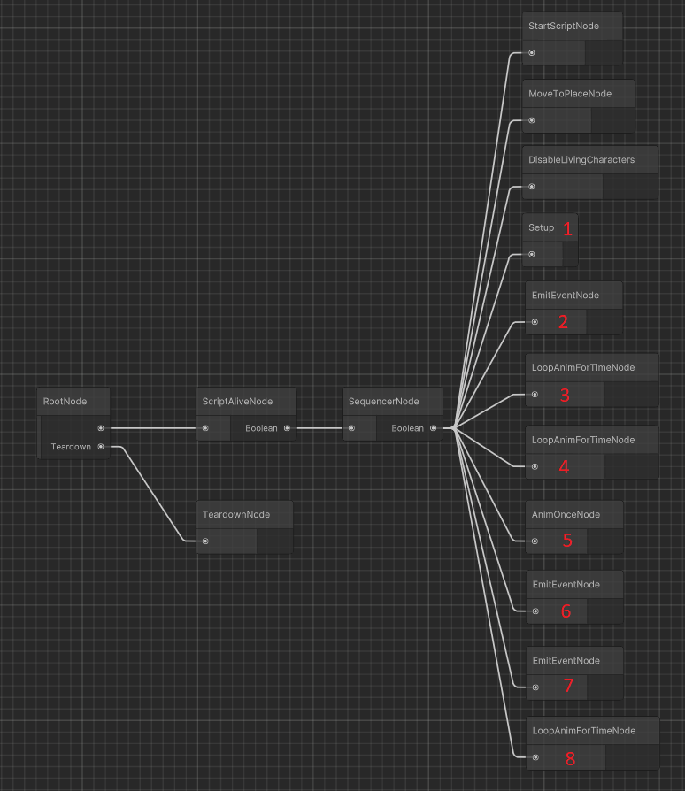
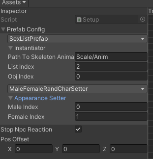
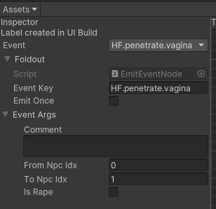
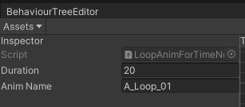
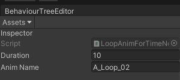
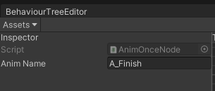
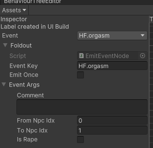
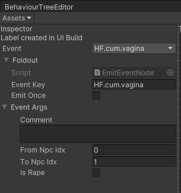

# Your first script

In this section we will re-create one of the original game sex scripts as an example.

## What are we building

- A "Common Sex NPC" script. Which is a friendly NPC x NPC interaction.
- This interaction will be between Male Native (NPC ID = 10) and Female Native (NPC ID = 15, No pregnancy belly, alive)
- The animation played will be the one listed in the preview window as "2-0"

## Important background info

It is important to understand how CommonSexNPC is generally working in the game:

1. NPCs enter a "wait" state so their general AI stop
2. They trigger a heart emotion and start to walk to the sex place
3. Once in place, they are completely removed from the world (but continues detecting enemies)
4. The animation object is created with a (0, 0, 0.02) offset
5. They emit a "Penetration" event (Because we do `SexCount.Normal` increase)
6. They play the first sex speed animation (`..._Loop_01`) for 20 seconds
7. They play the second sex speed animation (`..._Loop_02`) for 10 seconds
8. They play the finish animation (`..._Finish`) once (for its duration)
9. They emit a "Orgasm" event
10. They emit a "Creampie" event (Because we do `SexCount.Creampie` increase)
11. They play the finish idle animation (`..._Finish_idle`) for 8 seconds
12. They are back into the world, finishing the interaction.

For Male Native / Female Native, `...` is `A`.

The script will imediatelly fail if:
- One of the characters dies
- One of the characters leaves the "Wait" status (e.g. because they found an enemy)

Additionally, upon reaching the successful end, they have a few status changes:
- Their libido goes down by 20
- Their moral goes up by 3
- Their love to each other goes up by 10

Finally, it is also important to know that the animation object is listing in a game object called "Sex List", having its list index as 2, and inside it, an object index of 0. (That's why it is 2-0)

> [!NOTE]
> There are plans to expand HFramework so you don't have to worry about all these details in the future, but for now, we need to know them.

## Building your script

### Step 0: Prepare your Unity

Follow the [Unity guide](../unity-setup.md) to prepare your Unity environment.

### Step 1: Create the "project"

In your Unity project:

1. Create a new folder called `MyFirstHFMod` in your Assets directory
2. Assign this folder to a new asset bundle called `MyFirstHFMod` (name is up to you, [see how to do it](../../notes/unity-asset-bundles.md))

### Step 2: Create your script

1. Right click inside `MyFirstHFMod` and select `Create > Common Sex NPC Script`
2. Name it `MyFirstHFMod.Example` (any name works, it is recommended to prefix with your mod name)
3. Select it and check the inspector window, we will now fill with the conditions for it to run. Fill `Info` as follows:
	- `NPCs`:
		- Element 0
			- NPC ID: 10
			- Pregnant: Any
			- Faint: Not Fainted
			- Dead: Not Dead
		- Element 1
			- NPC ID: 15
			- Pregnant: Not ready to give birth
			- Faint: Not Fainted
			- Dead: Not Dead
	- `Npc order matters`: unchecked
	- `Start conditions`: empty
	- `Execute conditions`: empty

This will mean that:

1. We want HFramework to consider this whenever there is a CommonSexNPC check (because of the script type)
2. It should happen when Male Native wants to sex Female Native or vice-versa, as long as:
	- Male native is not fainted/dead
	- Female native is not fainted/dead
	- Female native does not have the pregnancy belly (she may be pregnant or not, but not have the belly yet)

### Step 3: Building the graph

1. Select `Behaviour Tree > Editor...` on the top of the Unity window
2. Select `MyFirstHFMod.Example` on your assets folder
3. You should see a graph with a single `RootNode`
4. Build the following structure there:

We can see that the flow starts from Root, goes into ScriptAlive -- which will basically continuously check if the NPCs are still in a "sexable" state (e.g. didn't get a target, or died, etc), and then into a Sequencer node, that will basically do each step of this sex script in order, until the end.

The sequence there is somewhat straightforward:

1. Do some initialization (this is script specific, but assume it as a common step for now)
2. Moves the characters to the sex place (Which was inputed in the script by HFramework)
3. Hides the characters
4. Setup the prefabs
5. Perform the needed animations / emit events.

There is one special node that you may notice that has its own connection to `RootNode`: `Teardown`.

`Teardown` is a special node that will always run at the end, regardless of success or failure, and it works in restoring needed things (specially unhiding characters, or reseting their states). While usually just linking `Teardown` is enough, you could also use a `SequencerNode` and do several things there.

Now, let's configure each of the numbered nodes

#### 1 - Setup node

This node will tell how to build the sex animation prefab.

It will look like that: (details below)

##### Instantiator

Since we are using the game's own prefab, which is located at SexList 2-0, we should set our Prefab Config as follows:

- SexListPrefab
- Instantiator/Path to Skeleton animation: `Scale/Anim`
- Instantiator/List Index: 2
- Instantiator/Obj Index: 0

This tells HFramework to use `SexListPrefab` to drive the creation, using 2-0 animation. Additionally, in order to locate the `SkeletonAnimation` in this Prefab, it should look at `Scale/Anim` (this was got from the game's object/code)

##### Appearance Setter

The next step, is how to set the appeareance of the characters in the prefab. This tells how we should grab the character real appearance and map it into the prefab.

The next dropdown is meant to choose the class for that. We want `MaleFemaleRandCharSetter`, because this is how the game does it (See the dedicated docs about details). Using `RandomCharacter` with a specific configuration for a male/female pair.

Expanding Appearance Setter, we will see the details for this class, we should configure as follows:

- Male Index: 0
- Female Index: 1

This comes again to the order of the NPCs in the SexScript, internally HFramework will translate to them.

##### Other settings

- Stop NPC Reaction should be false -- we want NPCs to react in case enemies appear, etc
- Pos Offset: should be (0, 0, 0.02) -- just to match the game's behavior

#### 2 - EmitEventNode (Penetrate)

After the animation is set, we start emitting a penetration event.

Configure that node as follows:

The "Event Args" block changes based on the selected event. For Penetrate, we have a From (who is penetrating) and a To (who is being penetrated).

Here again, we use indexes.

#### 3 - Loop Anim For Time (A_Loop_01)

This node will loop the animation `A_Loop_01` for a given time. It will look like that:

Here we set the animation name and the time to loop it. Pretty straightforward.

#### 4 - Loop Anim For Time (A_Loop_02)

This node will loop the animation `A_Loop_02` for a given time. It will look like that:

Here we set the animation name and the time to loop it. Pretty straightforward.

#### 5 - Anim Once (A_Finish)

This node will play the animation `A_Finish` once, for its default duration, until the end. It will look like that:

Here we just need the animation name. Pretty straightforward.

#### 6 - EmitEventNode (Orgasm)

This node will emit an orgasm event. It will look like that:

We usually consider that every sex scene ends with an orgasm, but not necessarily a cum (depending on the scenario).

#### 7 - EmitEventNode (Creampie)

This node will emit a `HF.cum.vagina` event, a creampie. It will look like that:

#### 8 - Loop anim for time (A_Finish_idle)

Finally, this node will loop the animation `A_Finish_idle` for a given time. It will look like that:

### Finishing up

Now that we have everything configured, we can export it and load into the game.

Right click on Project > `Build AssetBundles`

Now you can copy the assetbundle from `Assets/AssetBundles` to your game's `BepInEx/CustomBundles/` folder and start the game.
