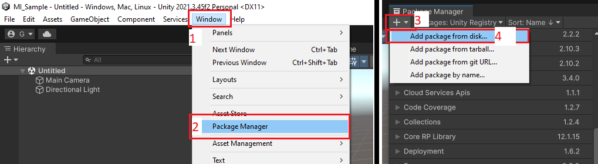

# Unity Setup

<!-- @TODO: Fix branch and try import from git -->

1. Setup a minimal unity project following [YotanModCore / Minimal Unity Project](../guide-ymc/minimal-unity-project.md) guide, including YotanModCore.
2. Clone Yotan's repository somewhere OUTSIDE of your Unity project -- Git repo: https://github.com/yotan-dev/mad-island-mods
3. Switch to `hf-states` branch (This is for the experimental version only, later on, will be main)
4. Back on Unity, go to `Window` > `Package Manager`, then in the new window `+` > `Add package from disk...`

5. Select the `package.json` file located at `<cloned-repository>/HFrameworkLib/src/package.json`

After it loads, you should not see any errors in the console.

You should now see a `Behaviour Tree` menu item in the top menu bar and right clicking on asset folder should give you "HFramework" options.

If you see that, you are ready to go.
