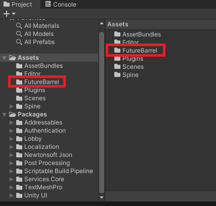
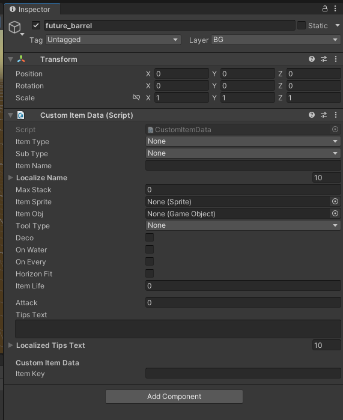
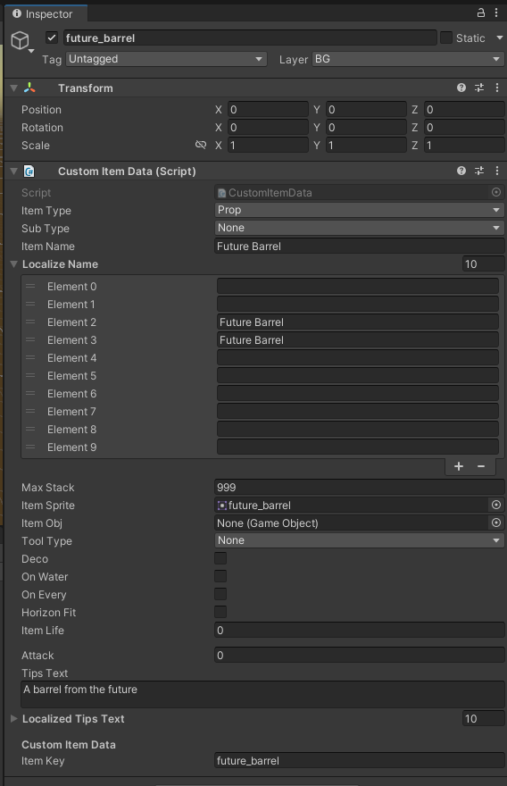
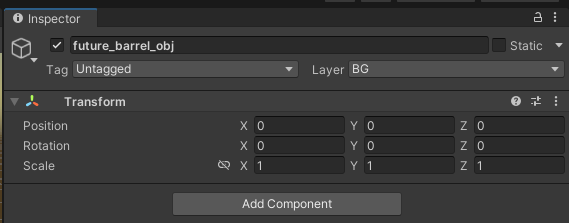
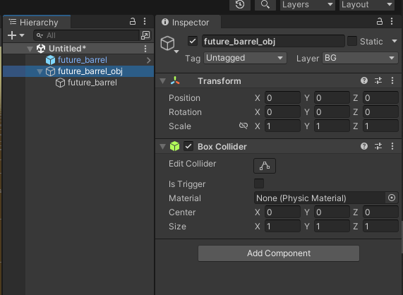
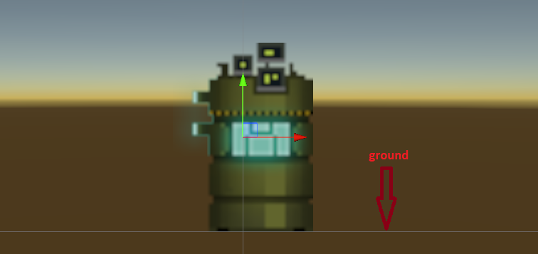
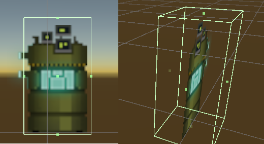
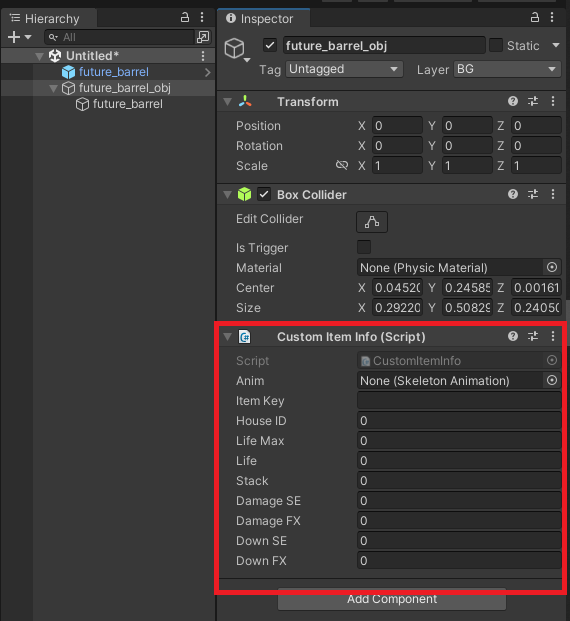
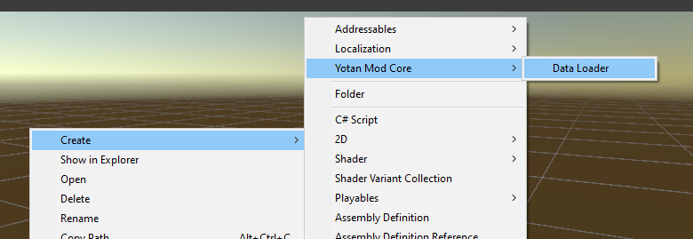

# Your first static item

> [!WARNING]
> This is an [experimental API (see versioning policy)](../introduction.md#versioning-policy) and may change in the future. Feedback is welcome.
>

This guide will introduce you to creating your first static item and loading it into the game
by using Yotan Mod Core.

## Pre-requisites

It is recomended to have read the [overview](./overview.md) first.

1. A Unity project with Yotan Mod Core installed
   1. See [Minimal Unity project](../minimal-unity-project.md)
   2. See [Adding Yotan Mod Core to Unity project](../unity-project-yotan-mod-core.md)
2. A PNG image to be used for your item
   1. This guide will be using files from [190+ Pixel Art (Sci-fi & Forest) by Ganamoda (OpenGameArt)](https://opengameart.org/content/190-pixel-art-assets-sci-fi-forest)

## Creating a folder for your work

First, create a folder to store your assets, this will help you organize your mod.

For this tutorial, I am creating a folder called `FutureBarrel` in the `Assets` folder.

## Import the sprite

1. Drag the item sprite PNG into the folder, in my case, I have used `Green Barrel` and renamed it to `future_barrel.png`
2. Change the `Texture Type` to `Sprite (2D and UI)` so it works properly for items
3. Click apply

## Creating the inventory item

On this step, we are creating the initial item which appears as it appears in your inventory,
and configure some important info about it.

On a unity scene:

1. Create an empty object called `future_barrel`
2. Add the `CustomItemData` component to it

`CustomItemData` contains general information about your item, lets fill it: (fields not informed here should be left as default)

- Item Type: `Prop`
- Item Name: `Future Barrel` (This is the Japanese name)
- Localize Name:
  - Element 2: `Future Barrel` (This is the English name)
  - Element 3: `Future Barrel` (This is the Chinese (?) name)
- Max Stack: `999`
- Item Sprite: Drag the sprite you made in the previous step
- Tips Text: `A barrel from the future` (Japanese tooltip)
- Localized Tips Text:
  - Element 2: `A barrel from the future` (English tooltip)
  - Element 3: `A barrel from the future` (Chinese (?) tooltip)
- Item Key: `future_barrel` (This is the key that will be used to identify the item in the game. MUST BE UNIQUE)

It should look like this:

Now turn it into a prefab by drag and dropping this object into your `FutureBarrel` folder.

## Creating the world item

Now we need to create the item that appears once we put it into the world.

1. Create an empty object called `future_barrel_obj`
2. set its layer to `12: BG`, this will tell the game to consider it as part of the world that you can interact with.

3. Drag the item sprite into `future_barrel_obj`, this will create a sub element with its sprite
4. Make sure the sprite is at Position (0, 0, 0)
5. Add a `Box Collider` to `future_barrel_obj` (the root element)

6. Adjust the **sprite** position so its bottom is aligned with the ground, you can use the 2D view for that

> [!WARNING]
> Be careful to change the **sprite** (child element) position and not the parent (`_obj`)

7. Adjust the `Box Collider` so it is around the object. This will create the hitbox for the item. Also check the 3d world, as it will control when characters go "behind" the item.

8. Add the `CustomItemInfo` component to `future_barrel_obj`

9. Fill the `CustomItemInfo` component as follows:
   - Item Key: `future_barrel` (MUST MATCH THE KEY FROM THE PREVIOUS STEP)
10. Create a prefab of `future_barrel_obj` by dragging and dropping the `future_barrel_obj` into your `FutureBarrel` folder

You are now ready to register it into the game.

## Linking the world item to the inventory item

1. Go back to the `future_barrel` prefab
2. On the `CustomItemData` component, drag the `future_barrel_obj` prefab into the `Item Obj` field
3. Save the updated prefab

## Registering it into the game with Yotan Mod Core

1. Right click on the `FutureBarrel` folder and select `Create > Yotan Mod Core > Data Loader`

2. Accept the default name of `YMCDataLoader`. THIS MUST NEVER BE RENAMED!
3. Select `YMCDataLoader`
4. On the inspector, expand `Items` and click `+`
5. Drag and drop the `future_barrel` prefab into the list

## Creating an asset bundle

You should now have 4 files in your folder:

- `future_barrel.prefab` -- The inventory item
- `future_barrel.png` -- The sprite
- `future_barrel_obj.prefab` -- The world item
- `YMCDataLoader.asset` -- The data loader

We have to bundle them now so we can load into the game.

1. Select `YMCDataLoader`
2. On the Inspect window, at the very bottom, click on the first dropdown of `Asset Bundle`
3. Click on `new`
4. Give it a name (I will call mine `my_first_item`)
5. Add the same asset bundle to all 4 items
6. Right click the folder and select `Build AssetBundles`

## Getting it into the game

1. Using windows explorer, go to your Unity Project `AssetBundles` folder
2. Copy `my_first_item` (NOT the `manifest` file)
3. Go to your Mad Island folder
4. Go to `BepInEx/CustomBundles`
5. Paste the file there

Next time you load the game, the item will be loaded and available in `/get future_barrel`

## Troubleshooting

In case you had any issues, try to check BepInEx console logs.

A few things worth checking:

1. Did YotanModCore reported loading your item?
2. Is there any errors?

We should expand this as we know more...

## Next steps

Congrats! You've got your first basic item into the game.
Now you have the basics to explore further, check the detailed pages for how
to get more advanced features working.
