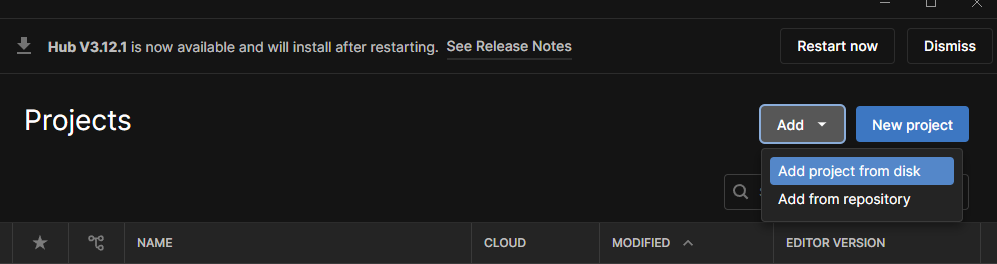
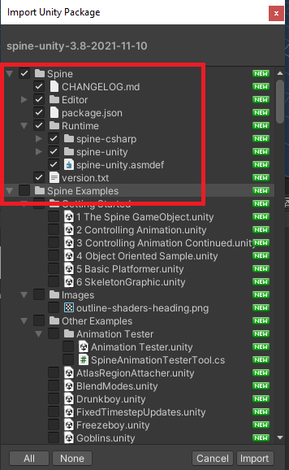
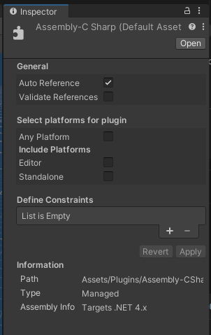

# Minimal Unity project

This guide aims at building a minimal Unity project that is compatible with Mad Island
so you can properly build AssetBundles for it. It also covers linking to Yotan Mod Core
as a starting point for creating customizations.


## Pre-requisites

1. Download Unity v2021.3.6f1 from Unity Hub
2. Download Spine Unity Runtime v3.8 from [Spine site](https://pt.esotericsoftware.com/spine-unity-download)
	- Direct link: [spine-unity 3.8 for Unity 2017.1-2020.3](https://esotericsoftware.com/files/runtimes/unity/spine-unity-3.8-2021-11-10.unitypackage)
3. Have a copy of Mad Island installed -- We will reference it as `<MadIsland folder>`
4. Download the [project template](./assets/mad-island-template.zip) -- We will reference it as `template`
	- At the end of this doc, there will be an explanation on how this template was created and why certain things are done.


## Preparing the project

1. Extract the downloaded template somewhere
2. Open Unity Hub and choose Add > Add Project from disk



3. Choose the folder with the template and click `Add Project`
4. It will display in the list of projects in Unity Hub, open it
5. You should get a Unity project with:
	- `Editor` folder with AssetBundle creation script
	- an empty `Plugins`
6. Drag and drop the `spine-unity` package you've downloaded into the Assets folder
7. The import window will show up, deselect `Spine Examples`



8. Click `Import` and wait for it to finish
9. Drag and drop your `<MadIsland folder>/Mad Island_Data/Managed/Assembly-CSharp.dll` into Unity's Plugins folder
10. Select the imported `Assembly-CSharp.dll` and configure it as follows, then `Apply`




You now have a minimal working project for Mad Island modding.
It does not include the game assets, but this is something for another day.

Next, we will set up Yotan Mod Core so you can get started adding stuff.


## Updating

Whenever the game updates, you will most likely want to update your project as well.

> [!WARNING]
> DON'T drag and drop the `Assembly-CSharp.dll` file, it will cause issues.

1. On Windows File Explorer, open your Unity Project and go to `Assets/Plugins` folder
2. Copy the new version of `Assembly-CSharp.dll` into it, and accept replacing the old one
3. Go back to Unity and it should recompile and work in the new version


## Next steps

Now that we have a project, we can start adding stuff to it.

You most likely will want to use Yotan Mod Core to get started, as it will ease your work.

- [Adding Yotan Mod Core to Unity project](./unity-project-yotan-mod-core.md)


## Creating from scratch and reasoning

This was roughly based on https://github.com/Valheim-Modding/Wiki/wiki/Valheim-Unity-Project-Guide

Download [AssetRipper](https://github.com/AssetRipper/AssetRipper/releases/) and
extract all assets from Mad Island -- this will be referenced as `<MI RIP>`


Create an empty folder -- this will be referenced as `<Template>`

Go to `<MI RIP>/ExportedProject/` and copy `Packages` and `ProjectSettings` folders into `<Template>`

> [!NOTE]
> `Packages` folder contains your project's dependencies, like Unity libraries, and
> copyting it ensures we have the same dependencies and avoid errors.
>
> `ProjectSettings` folder contains project settings like project Tags and Layers,
> we need those to match the game when creating items and etc.
>

Open `<Template>/Packages/manifest.json` and add the following:

```JSON
    "com.unity.localization": "1.3.2",
    "com.unity.postprocessing": "3.2.2",
    "com.unity.services.lobby": "1.0.3",
    "com.unity.textmeshpro": "3.0.6",
```

> [!NOTE]
> Those dependencies are also used by Mad Island, but for some reason not included during the RIP.
> We add them as we are likely to have issues or need them when modding.

On your `<Template>`, create this structure:

- `Assets/`
	- `Editor/`
		- `CreateAssetBundles.cs` -- Script to create Asset Bundles
	- `Plugins/` -- Folder for plugins that we can't ship


And that's it! Don't open it on Unity or it will generate lots of other files
